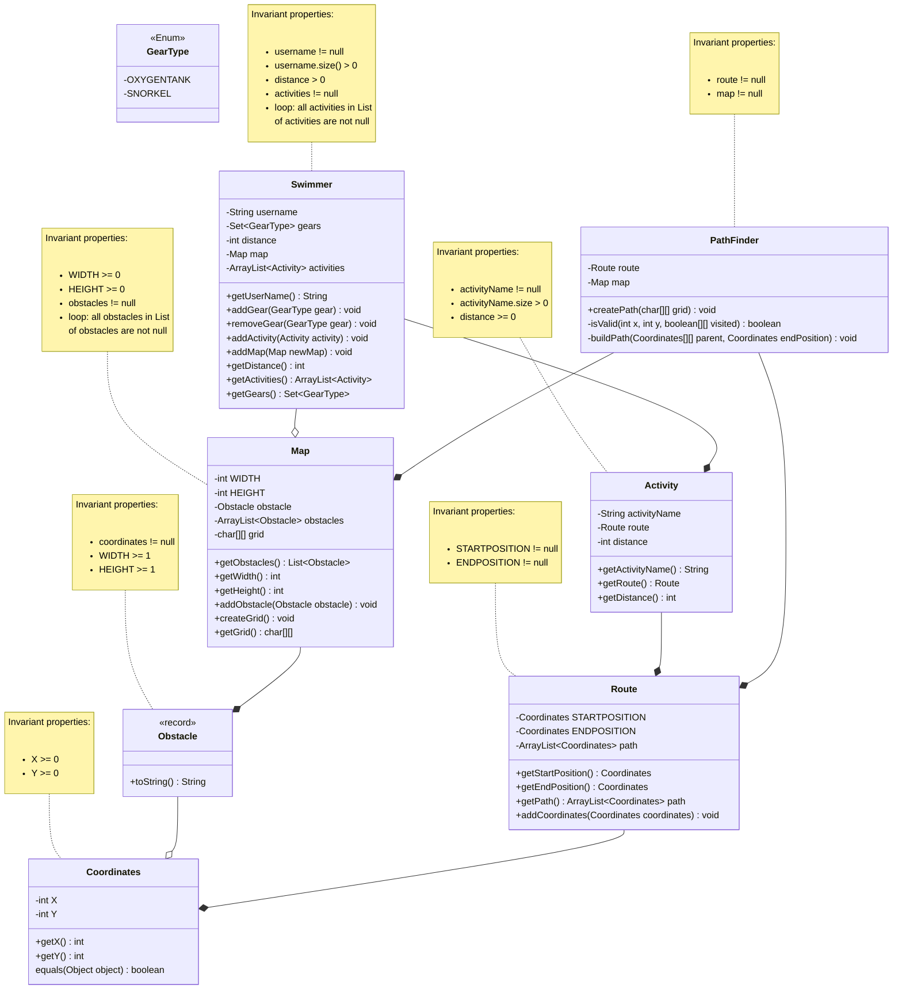

# David's Exercise Tracker

> The exercise tracker tracks the path along which a swimmer swims in a lake. It displays this information on a regular 2-dimensional grid. While swimming, the swimmer will have to avoid obstacles like rocks, logs and crocodiles. The swimmer relies on an oxygen tank during the weekdays and a snorkel during the weekend for a challenge.

### Mermaid diagram
Here is our domain model with attributes and initial behaviours added:

